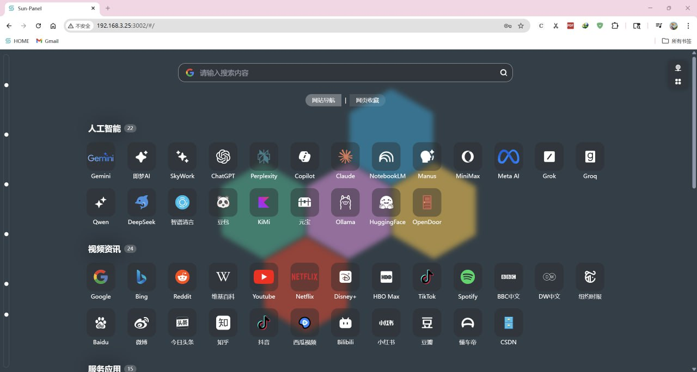
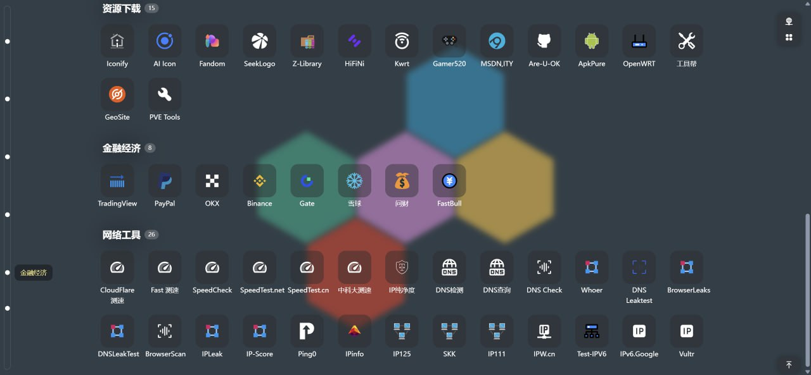
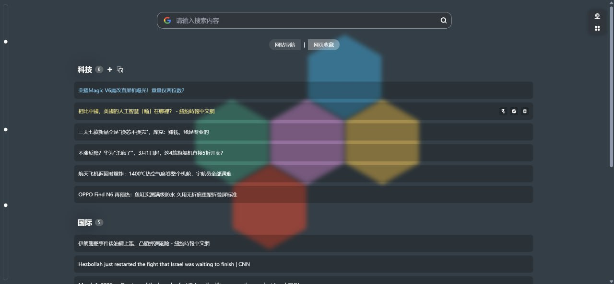
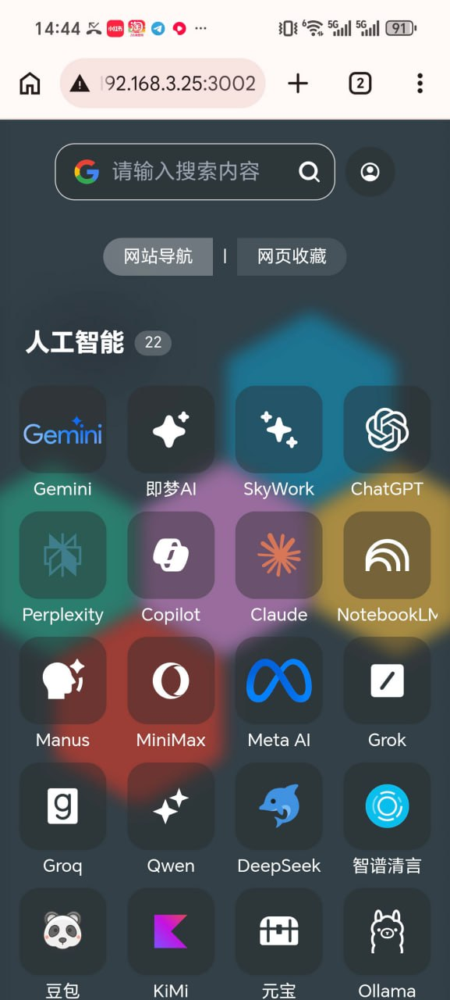
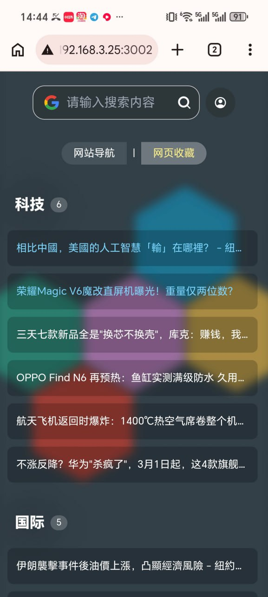

[[ 简体中文 ]](https://github.com/liandu2024/AnGe-Panel/blob/main/README.md) |
[[ English ]](https://github.com/liandu2024/AnGe-Panel/blob/main/README_EN.md)

<div align=center>



# AnGe-Panel

[](https://github.com/liandu2024/AnGe-Panel)
[](https://github.com/liandu2024/AnGe-Panel/pkgs/container/ange-panel) 
[](https://t.me/angeworld2024)
<br>

</div>

A perfect website navigation + webpage bookmarks panel.

---

## Main Features

### 1) Left Sidebar Navigation (Quick Jump)


- New "group sidebar" on the left side of the page. Click dots to **jump instantly** to the corresponding group.
- No more scrolling when you have many groups.

### 2) Two Collection Modes: Website + Webpage
- **Website**: Perfect for收藏「a site」and its entry points (e.g., NAS, blog, admin panel).
- **Webpage**: Perfect for收藏「an article / a page」link (e.g., Zhihu articles, news links, tutorial pages).
- Switch between "Website / Webpage" freely - search conditions are preserved.

### 3) Webpage Collection Enhanced


- Webpage list supports: one-click pin/unpin, quick edit, quick delete.
- Pin/Create/Edit/Delete **won't refresh the entire page** - no flashing or jumping.

### 4) Icons & Wallpapers - Separate Management with Reuse
- Distinguish between "icons" and "wallpapers" when uploading images.
- Previously uploaded icons/wallpapers can be **reused** from history - no need to re-upload every time.

### 5) Thoughtful UX Improvements
- Duplicate link detection (avoid saving the same URL twice).
- Auto-ellipsis for list titles, hover to see full names.
- Mobile-optimized experience (more compact, cleaner).




### 6) Access Tokens — Password-Free Login
- Each user can generate multiple personal access tokens. Append `?accessToken=xxx` to the URL to auto-login without entering a password.
- Tokens are stored as SHA256 hashes; the raw value is shown only once at creation. Revoke any token anytime in Settings → Access Tokens.

## Source Deployment

### Requirements

| Tool | Minimum Version |
|------|----------------|
| Go | 1.20 |
| Node.js | 16+ |
| pnpm | 8+ |

### Build

```bash
# 1. Backend
CGO_ENABLED=0 go build -o ange-panel ./main.go

# 2. Frontend (if you need to modify the source)
pnpm install
npx vite build

# 3. Prepare static files (symlink dist/ to web/)
ln -s $(pwd)/dist $(pwd)/web

# 4. Run
./ange-panel
```

> Note: Pre-built frontend files are committed in `dist/`. You can skip step 2-3 and just symlink `web -> dist`. The `web/` directory is the runtime serving path for static assets.

## 🔐 First Login

URL: http://[IP]:3005
- **Default Admin Username**: `admin`
- **Default Admin Password**: `admin`

On first startup, sample groups and example website/webpage links will be created automatically for quick testing.

> ⚠️ Please change your password after first login!

---

## ❤️ Thanks

- This project is forked from [AnGe-Panel](https://github.com/liandu2024/AnGe-Panel). Thanks to the original author for the design and development.
- Built upon [Sun-Panel v1.3.0](https://github.com/hslr-s/sun-panel). Thanks to the original project. 

---
